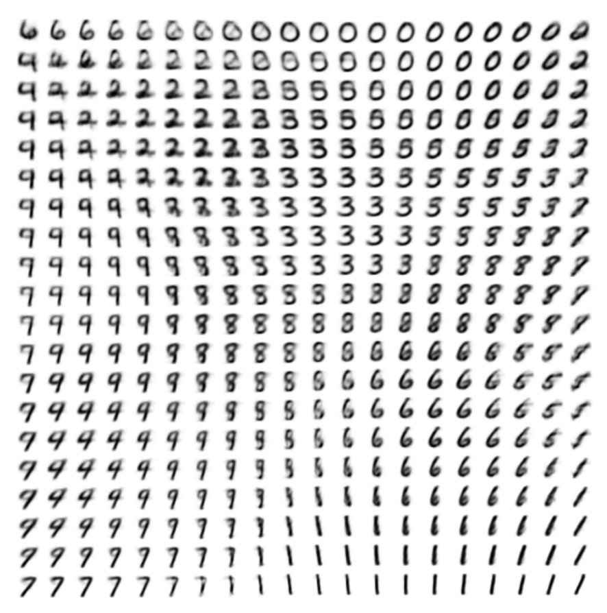
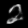
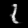

# Minimal Implementation of a VAE(Variational Autoencoder) with PaddlePaddle

## Auto-Encoding Variational Bayes
Diederik P Kingma, Max Welling
### Abstract:
How can we perform efficient inference and learning in directed probabilistic models, in the presence of continuous latent variables with intractable posterior distributions, and large datasets? We introduce a stochastic variational inference and learning algorithm that scales to large datasets and, under some mild differentiability conditions, even works in the intractable case. Our contributions are two-fold. First, we show that a reparameterization of the variational lower bound yields a lower bound estimator that can be straightforwardly optimized using standard stochastic gradient methods. Second, we show that for i.i.d. datasets with continuous latent variables per datapoint, posterior inference can be made especially efficient by fitting an approximate inference model (also called a recognition model) to the intractable posterior using the proposed lower bound estimator. Theoretical advantages are reflected in experimental results.

    

## Install

- Install PaddlePaddle, for more information, refer to [PaddlePaddle Installation Guide](https://www.paddlepaddle.org.cn/install/quick)

        python -m pip install paddlepaddle-gpu==3.1.0 -i https://www.paddlepaddle.org.cn/packages/stable/cu126/

## Usage

    python vae.py

## Sample Results

    
    
    
    
    
    
    
    
    
    

## References
- [VAE Paper: Auto-Encoding Variational Bayes](https://arxiv.org/pdf/1312.6114)
- [PyTorch-VAE](https://github.com/AntixK/PyTorch-VAE/tree/master?tab=readme-ov-file)
